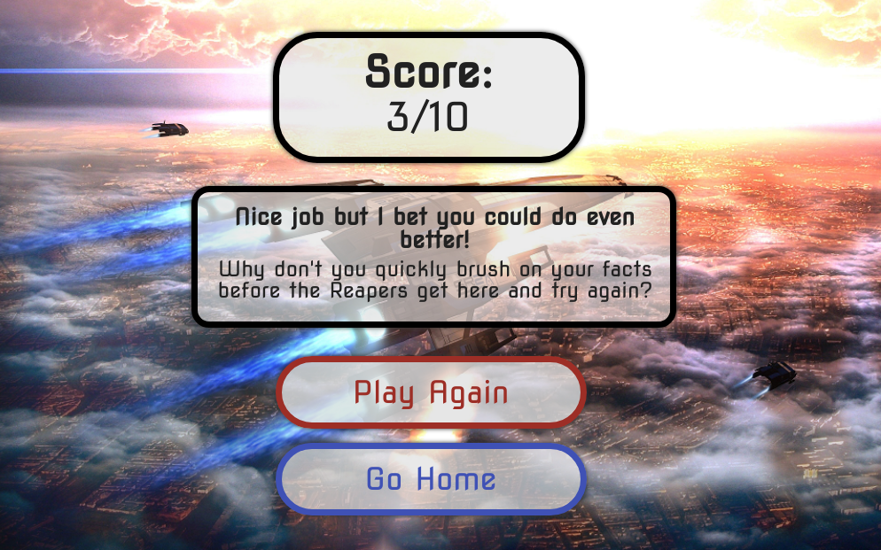

User Experience
======

### Target Audience
<ul> 
<li>Fans of the Mass Effect franchise by Bioware</li>
<li>People aged 16 to 35 which is the target audience of the game</li>
<li>Fans of gaming consoles such as Xbox, Playstation and PC</li>
<li>People looking to pass time and and expand their test their knowledge of the Mass Effect game</li>
<li>The gaming community as a whole</li>
<li>Trivia fans a those looking to have some fun while expanding their knowledge of the games</li>
</ul>

### User Requirements
<ul>
<li>A simple and efficient navigation system, suitable for any age</li>
<li>Clickable links that lead to corresponding pages</li>
<li>Attractive images that relate to the game</li>
<li>Bright fun colors that enhance and match the background images</li>
<li>Bright and eye-catching presentation</li>
<li>Factual questions and answers all relating to the game franchise</li>
<li>Good accessibility</li>
<li>High quality photos and functioning buttons</li>
<li>Images and colors throughout the site that relate to the game</li>
<li>Factual information that they can test their knowledge against</li>
<li>Different difficulty settings for the quiz</li>
</ul>

### User Stories

#### First-time User 
<ul>
<li>I want to easily understand the main purpose of the site and learn more about the game Mass Effect</li>
<li>I want to know I can trust any information provided by the website</li>
<li>I want the site to be visually appealing</li>
<li>I want to be able to easily navigate the site</li>
<li>I want corresponding links and buttons that lead to the pages they're indicated to</li>
<li>I want to be able to quickly restart the quiz at any time I need</li>
<li>I want colors and images that are eye-catching and will help keep my attention</li>
<li>I want to be able to change the difficulty setting of the quiz</li>
<li>I want to be able to see other users highscores</li>
<li>I want a progress bar to see what question I'm on and to immediately be able to see the result of the previously answered questions</li>
<li>I want all pictures and fonts to relate back to the videogame</li>
</ul>

#### Returning User
<ul>
<li>I want to see more Mass Effect questions</li>
<li>I want to be able to provide feedback about the site and submit any suggestions I might have that I would like to see added to the site</li>
<li>I want to see more social media and youtube links to help me connect to the community involved with Mass Effect</li>
<li>I want there to be more questions in the quiz when you return to the site</li>
<li>I want there to be the option to answer questions about a specific category in the game</li>
<li>I want to be able to log my Highscore live and compare it to others</li>
<li>I want to see more pictures with each questions</li>
<li>I want to be able to go back to a previously answered question and change my answer</li>
</ul>

Design
======

### Structure

The site is structured in a simple, easy to navigate way

The buttons and clickable links are big and easy to find

The homepage provides you with somewhere to navigate to all corresponding pages

The start page contains buttons and links which allow users to chose their preferred difficulty setting

There is also a highscore button for users to see the highest scorer and compare scores

Th quiz itself contains a question and 4 clickable answers

There is a live progress bar below the answers to inform the user of their current score

There is a restart buttton for the user to restart the quiz at any time

### Color

For the color scheme, the main buttons design was choosen to reflect the design used in the Mass Effect franchises user interface

The colorful buttons were chosen to make the webpage look more appealing and eye-catching

After deciding on the colour I tested them on WebAIM to make sure the contrast between them was right
 

### Typography

Nova Square was the font used for all text in the game. The font was found on Googlefonts and was used because it was easy to read and because it matches the themes present in the Mass Effect franchse.

### Wireframes

Homepage

Game page

End page

Highscore page

Features
======

### Home Page
<ul>
<li>Easy accesible buttons to naivagte through the rest of the site</li>
<li>Piques the interests of visitors to give them a overall impression of what the quiz will be like</li>
<li>Users are given are clear image of what the site is about</li>
</ul>

### Start Buttons
<ul>
<li>Allow the users to chose what difficulty quiz they would like to experience</li>
</ul>

### Quiz Page
<ul>
<li>Displays 10 questions for each difficulty that contain 4 possible choices</li>
<li>A live bar for users to track their score and progress</li>
<li>A restart button which allows the user to restart the quiz at any point or choose another difficulty</li>
</ul>

### Highscore Page
<ul>
<li>Displays the highest scoring users data</li>
<li>Easy accesible and allows the users to compare their scores against others</li>
</ul>

### End Page
<ul>
<li>Shows congratulatory text and ends quiz</li>
<li>Displays buttons for user to use if they wish to start the quiz again, check the highscores or go to the homepage</li>
</ul>

Technologies Used
======

### Languages

<ul>
<li>HTML</li>
<li>CSS</li>
<li>Javascript</li>
</ul>

### Frameworks & Tools

<ul>
<li>Mockflow</li>
<li>Tinypng</li>
<li>Git</li>
<li>GitHub</li>
<li>Gitpod</li>
<li>Google Fonts</li>
<li>Font Awsome</li>
</ul>

Testing
======

## Validator Testing

### Html
No errors were returned when passing through the official W3C validator

### Css
No errors were found when passing through the official (Jigsaw) validator

### Javascript
No errors were found when passing through the official JSHint validator

### Fixed Bugs or Issues
<ul>
<li>Encountered an issue on mobile screens with sizing. When the site was viewed on a mobile screen the highscore page was zoomed out and the Home button was pushed up and overlaping the Highscore call. I was able to correct this bug by reducing the padding on the content.</li>
<li>Encountered an issue with Javascript. I followed a tutorial initially but when I decided I would like 2 quizzes with different difficulties that meant I had to rewrite many functions because they werent applicable anymore</li>
</ul>

Deployment
======

The site was deployed to GitHub pages. The steps I used to deploy are as follows:

In my GitHub repository https://github.com/MagQ98/JS-Quiz, I navigated to the Settings tab

From the source section drop-down menu, I selected the Master Branch

Once the master branch was selected, the page was automatically refreshed with a detailed ribbon display to indicate the successful deployment.

The live link can be found here - https://magq98.github.io/JS-Quiz/index.html

Credits
======

### Tutorials

https://www.youtube.com/watch?v=TT7ufOKX-U4&ab_channel=VictorWooding 

https://www.youtube.com/watch?v=49pYIMygIcU&ab_channel=CodeExplained

https://www.youtube.com/watch?v=riDzcEQbX6k&ab_channel=WebDevSimplified
 

https://webdevtrick.com/create-javascript-quiz-program/

https://www.w3schools.com/

### Media and Content

https://wall.alphacoders.com/by_collection.php?id=31

https://wallpapercave.com/mass-effect-1080p-wallpaper

https://www.proprofs.com/quiz-school/story.php?title=ultimate-mass-effect-quiz

https://www.sporcle.com/games/amaranth/masseffect_trivia

### Acknowledgements

My mentor and tutor for continuous helpful feedback